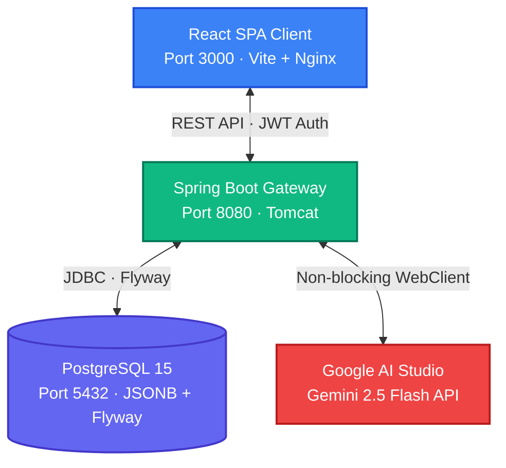
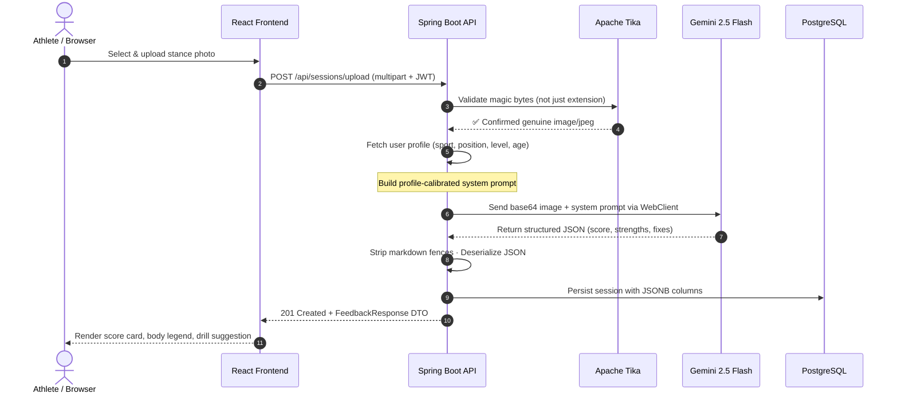
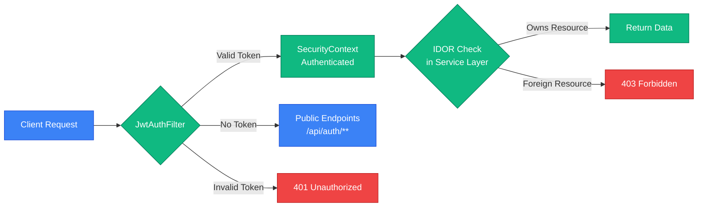
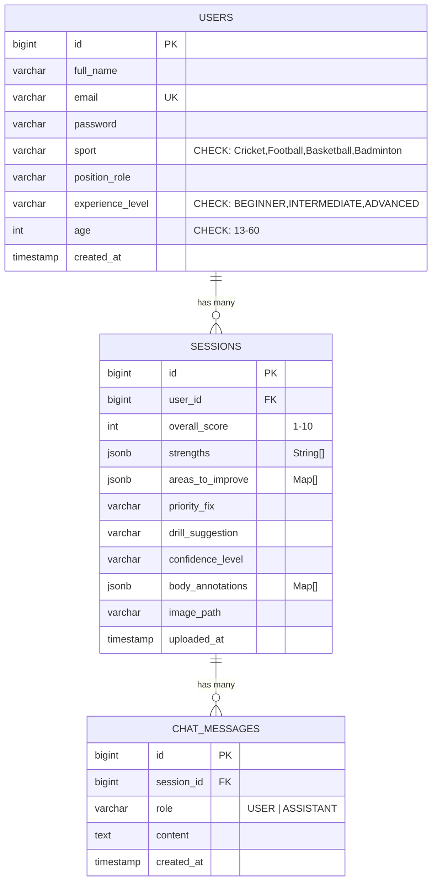

<div align="center">

# 👻 Ghost Coach

### AI-Powered Sports Coaching Platform

*Analyze athlete stance photos with Gemini Vision AI. Get structured, profile-calibrated technique feedback. Chat with your AI coach for follow-up guidance.*

<br />

<p>
  
  
  
  
  
  
  
  
  
  
</p>


</div>

---

## Table of Contents

- [Live Demo Video](#-live-demo-video)
- [Quick Start](#-quick-start-under-5-minutes)
- [System Architecture](#-system-architecture)
- [Feature Set](#-complete-feature-set)
- [AI Prompt Engineering](#-ai-prompt-engineering--parsing-architecture)
- [Engineering Decisions](#-engineering--architecture-decisions)
- [Security Architecture](#-security-architecture)
- [API Reference](#-api-endpoint-reference)
- [Database Design](#-database-design)
- [UI/UX Design](#-uiux--dynamic-empty-states)
- [Known Limitations & Mitigations](#-known-limitations--professional-mitigations)
- [Future Roadmap](#-future-product-roadmap)
- [Code Quality Signals](#-evaluation--code-quality-signals)
- [Bonus Features](#-bonus-features-implemented--honest-boundaries)
- [Project Structure](#-project-directory-layout)
- [Retrospective](#-what-i-would-do-differently-given-more-time)

---

## 🎬 Live Demo Video

<div align="center">

<a href="https://www.loom.com/share/c51e1b8bd724439082667e03e258428d">
  
</a>

**[▶ Click to watch the full walkthrough (4:43)](https://www.loom.com/share/c51e1b8bd724439082667e03e258428d)**

</div>

**What the video covers:**

| Timestamp | Topic | What You'll See |
|:---|:---|:---|
| `0:00` | **Platform & Stack Overview** | Docker Compose orchestration, 3 healthy containers, system health verification |
| `2:00` | **Stance Photo Analysis** | Upload flow, Apache Tika magic-byte validation, Gemini 2.5 Flash Vision API call |
| `4:20` | **AI Feedback & Body Legend** | Score card rendering, strength/weakness breakdown, anatomical annotation panel |
| `5:53` | **Chat & Progress Tracking** | Context-injected coaching chat, Recharts gradient analytics, Swagger UI |

---

## 🚀 Quick Start (Under 5 Minutes)

Deploy the entire full-stack application locally with a single command.

### Prerequisites

| Tool | Version | Purpose |
|:---|:---|:---|
| **Docker Desktop** | v20+ | Container orchestration with WSL2 |
| **Google AI Studio API Key** | — | Free at [aistudio.google.com/apikey](https://aistudio.google.com/apikey) |

### Launch

```bash
# 1. Clone and enter the project
git clone https://github.com/Manoj-0810/ghostcoach
cd ghostcoach

# 2. Configure environment
cp .env.example .env
# Open .env and set: GEMINI_API_KEY=AIzaSy...

# 3. Build and launch all services
docker-compose up -d --build
```

### Verify Health

```bash
# All 3 containers should show "Up" and "healthy"
docker ps

# Confirm Spring Boot + Flyway migrations completed
docker logs ghostcoach-api --tail 20
```

> [!TIP]
> The backend waits for PostgreSQL to pass its health check before booting. Flyway migrations (`V1`, `V2`, `V3`) run automatically on first launch.

### Service Map

| Service | URL | Details |
|:---|:---|:---|
| 🖥️ **Frontend** | [http://localhost:3000](http://localhost:3000) | React SPA — responsive Dashboard & Coaching UI |
| ⚙️ **Backend API** | [http://localhost:8080](http://localhost:8080) | Spring Boot REST gateway |
| 📖 **Swagger Docs** | [http://localhost:8080/docs](http://localhost:8080/docs) | Interactive OpenAPI 3.0 with JWT auth support |
| 🗄️ **PostgreSQL** | `localhost:5432` | User: `ghostcoach` · DB: `ghostcoach` |

---

## 🏗️ System Architecture

Ghost Coach is built on a decoupled, service-oriented architecture designed for visual analysis pipelines and contextual chat streams.

### High-Level Topology



### Request Flow — Stance Analysis Pipeline



---

## 🎯 Complete Feature Set

All **5 core functional requirements** are fully implemented, plus 3 bonus features.

### Feature 1 — Unified Authentication Suite

| Capability | Implementation |
|:---|:---|
| **Athlete Registration** | Captures Full Name, Email, Age, Sport, Position, Experience Level |
| **Input Validation** | JSR-380 `@NotBlank`, `@Email`, `@Min(13)`, `@Max(60)` on controller DTOs |
| **Password Security** | BCrypt with strength factor 12 — salted, hashed, constant-time comparison |
| **Session Management** | Stateless JWT via `jjwt` 0.12.5 — HS512 signed, 24h expiry |
| **Sport Validation** | Database-backed `CHECK` constraints (Cricket, Football, Basketball, Badminton) |

### Feature 2 — Intelligent Stance Technique Review

| Capability | Implementation |
|:---|:---|
| **Magic-Byte Validation** | Apache Tika inspects raw file stream headers — blocks renamed executables |
| **File Size Enforcement** | Hard 5MB cap via Spring multipart config + controller validation |
| **Multimodal Vision AI** | Image bytes + dynamically calibrated prompt → Gemini 2.5 Flash |
| **Structured Feedback** | Returns: `overallScore`, `strengths[]`, `areasToImprove[]`, `priorityFix`, `drillSuggestion`, `confidenceLevel`, `bodyAnnotations[]` |
| **Experience Calibration** | Prompt adapts tone, jargon level, and specificity for BEGINNER / INTERMEDIATE / ADVANCED |

### Feature 3 — Paginated Session History

| Capability | Implementation |
|:---|:---|
| **Dashboard Cards** | Thumbnail, score badge, sport tag, upload timestamp, priority fix preview |
| **Pagination** | Backend `Pageable` with configurable page size (max 50) to prevent memory exhaustion |
| **Detail Drill-Down** | Expand any session → full body annotations, strengths, improvement cards, chat history |
| **Query Optimization** | `JOIN FETCH` in all repository queries — zero N+1 database round-trips |

### Feature 4 — Context-Aware AI Coaching Chat

| Capability | Implementation |
|:---|:---|
| **Session-Scoped Context** | Injects original score, priority fix, drill suggestion, and areas to improve into every chat prompt |
| **Multi-Turn History** | Full conversation history mapped to Gemini's `user`/`model` turn format |
| **Profile Awareness** | Sport, position, experience level, and age injected as system instructions |
| **Smart Formatting** | Double-newline instruction enables clean paragraph splitting in React UI |

### Feature 5 — Side-by-Side Session Comparison

| Capability | Implementation |
|:---|:---|
| **Comparative UI** | Two sessions rendered adjacent — score, strengths, improvements, body annotations |
| **Visual Delta Metrics** | Score delta calculation with trend arrows (↑ / ↓) and color-coded indicators |
| **IDOR Protection** | Backend validates both session IDs belong to the authenticated user before returning data |
| **API Endpoint** | `GET /api/sessions/compare?id1=...&id2=...` with double-ownership verification |

---

## 🤖 AI Prompt Engineering & Parsing Architecture

The core value of Ghost Coach lies in how the vision model is instructed, validated, and parsed into type-safe application state.

### Stance Analysis Prompt

The `GeminiService` dynamically builds a profile-calibrated system prompt for each upload:

```
You are an elite {SPORT} coach with 20 years of professional experience
specializing in technique analysis at youth and semi-professional level.

You are reviewing a stance photo submitted by a {LEVEL}-level {POSITION}
in {SPORT}, aged {AGE}. Calibrate every piece of feedback precisely:
  - BEGINNER: foundational corrections, encouraging tone, avoid jargon
  - INTERMEDIATE: technical specificity, reference named techniques
  - ADVANCED: precision corrections, competitive-level detail

Respond ONLY with a valid JSON object matching this exact schema:
{
  "overallScore": <integer 1-10>,
  "strengths": ["<observation>", "<observation>"],
  "areasToImprove": [
    {"issue": "<label>", "explanation": "<1-2 sentences>"}
  ],
  "priorityFix": "<single most critical correction>",
  "drillSuggestion": "<named drill + how to perform it>",
  "confidenceLevel": "<LOW|MEDIUM|HIGH>",
  "bodyAnnotations": [
    {"label": "<body part>", "description": "<fix>", "importance": "<HIGH|MEDIUM|LOW>"}
  ]
}
```

### Follow-Up Chat Prompt

Every coaching chat is context-injected with the original session analysis:

```
You are Ghost Coach — an expert {SPORT} coaching assistant having a
follow-up conversation with a {LEVEL} {POSITION}, aged {AGE}.

Their last session analysis:
  - Overall Score: {SCORE}/10
  - Priority Fix: {PRIORITY_FIX}
  - Drill Suggested: {DRILL_SUGGESTION}
  - Areas to Improve:
    {AREAS_TO_IMPROVE_LIST}

Answer as a knowledgeable, direct coach. Keep responses under 150 words.
Be specific to {SPORT} and their experience level. No generic advice.
```

### Response Parsing Pipeline

```
Gemini Raw Output ──▶ Strip ```json fences (regex) ──▶ Jackson ObjectMapper ──▶ FeedbackResponse DTO
                                                                                    │
                                                                  Validated fields: overallScore ∈ [1,10]
                                                                                    confidenceLevel ∈ {LOW,MEDIUM,HIGH}
                                                                                    bodyAnnotations[].importance validated
```

> [!NOTE]
> The response parser (`GeminiResponseParser.java`) gracefully handles cases where Gemini wraps output in markdown code fences, despite explicit prompt instructions not to. This defensive parsing prevents deserialization failures in production.

---

## ⚡ Engineering & Architecture Decisions

Every dependency and pattern was chosen to solve a specific technical challenge.

### 1. Spring Boot 3.2.5 + Java 17

| Decision | Rationale |
|:---|:---|
| **Stateless JWT Filters** | `JwtAuthFilter` intercepts every request in the security filter chain — no session storage, no cookie management |
| **JSR-380 Bean Validation** | `@NotBlank`, `@Email`, `@Min`, `@Max` on DTOs validate at the controller boundary — invalid requests never reach service classes |
| **Text Block Prompts** | Java 17 text blocks (`"""..."""`) keep multi-line AI prompts readable and maintainable in source code |

### 2. PostgreSQL 15 + JSONB Hybrid Schema

| Challenge | Solution |
|:---|:---|
| AI feedback structure is highly variable (dynamic arrays, nested objects) | Store structured user/session data with strict schemas; store AI feedback arrays in **JSONB** columns |
| Standard normalization would require 5+ tables + complex joins | JSONB provides binary-compiled, indexable, deeply nested storage in a single column |
| ORM serialization of JSONB | `io.hypersistence:hypersistence-utils-hibernate-62` auto-maps JSONB ↔ Java `List<Map>` |

### 3. Flyway Migration Strategy

```
V1__create_users_table.sql      ──▶  Users + sport CHECK constraints
V2__create_sessions_table.sql   ──▶  Sessions + JSONB columns + composite indexes
V3__create_chat_messages_table.sql ──▶ Chat messages + session FK + timestamp index
```

> [!IMPORTANT]
> Hibernate `ddl-auto` is set to `none`. All schema changes are version-controlled Flyway migration scripts. This guarantees identical schema state across local, staging, and production environments.

### 4. Apache Tika — Magic Byte Verification

| Threat | Defense |
|:---|:---|
| Attacker renames `malware.exe` → `photo.jpg` | Tika reads actual file stream headers (magic bytes) to confirm MIME type |
| Only extensions are checked | We verify the byte signature matches `image/jpeg`, `image/png`, `image/webp`, or `image/gif` before persisting |

### 5. WebClient over RestTemplate

| RestTemplate (Legacy) | WebClient (Our Choice) |
|:---|:---|
| Blocking, one-thread-per-request | Non-blocking I/O via Netty reactor |
| Thread pool exhaustion during slow AI calls | Server threads stay free during 3-8s Gemini latency |
| Deprecated in Spring 6+ | Officially recommended for new projects |

### 6. Retry + Fallback Strategy

The `GeminiService` implements a 3-attempt retry loop with exponential backoff:

```
Attempt 1: Primary model (gemini-2.5-flash) · delay 1.5s on failure
Attempt 2: Primary model (gemini-2.5-flash) · delay 3.0s on failure  
Attempt 3: Fallback model (gemini-1.5-flash) · throws on failure
```

Handles `429` (rate limit), `503` (overloaded), and all `5xx` transient errors gracefully.

---

## 🔐 Security Architecture



| Layer | Mechanism | Implementation |
|:---|:---|:---|
| **Password Storage** | BCrypt-12 (salted, adaptive hashing) | `SecurityConfig.passwordEncoder()` |
| **Token Issuance** | HS512-signed JWT, 24h TTL | `JwtTokenProvider.generateToken()` |
| **Request Auth** | Stateless filter chain, no sessions | `JwtAuthFilter.doFilterInternal()` |
| **IDOR Protection** | Every service method verifies resource ownership | `SessionService`, `ChatService` |
| **Input Validation** | JSR-380 annotations on all request DTOs | Controller boundary enforcement |
| **File Upload Safety** | Apache Tika magic-byte inspection | `FileValidator.validateImage()` |
| **Error Containment** | Global exception handler — no stack trace leaks | `GlobalExceptionHandler.java` |
| **API Key Isolation** | `.env` only, excluded in `.gitignore` | Never committed to version control |

---

## 📡 API Endpoint Reference

All endpoints are documented with interactive testing in [Swagger UI](http://localhost:8080/docs).

### Authentication

| Method | Endpoint | Auth | Description |
|:---|:---|:---|:---|
| `POST` | `/api/auth/register` | Public | Create athlete account with profile |
| `POST` | `/api/auth/login` | Public | Authenticate and receive JWT |

### Sessions

| Method | Endpoint | Auth | Description |
|:---|:---|:---|:---|
| `POST` | `/api/sessions/upload` | 🔒 JWT | Upload stance photo → AI analysis |
| `GET` | `/api/sessions` | 🔒 JWT | Paginated session history |
| `GET` | `/api/sessions/{id}` | 🔒 JWT | Full session detail + feedback |
| `GET` | `/api/sessions/compare?id1=...&id2=...` | 🔒 JWT | Side-by-side session comparison |

### Chat

| Method | Endpoint | Auth | Description |
|:---|:---|:---|:---|
| `POST` | `/api/sessions/{id}/chat` | 🔒 JWT | Send follow-up question to AI coach |
| `GET` | `/api/sessions/{id}/chat` | 🔒 JWT | Retrieve conversation history |

### System

| Method | Endpoint | Auth | Description |
|:---|:---|:---|:---|
| `GET` | `/docs` | Public | Swagger UI — interactive API testing |
| `GET` | `/uploads/{filename}` | Public | Serve uploaded images |

---

## 🗄️ Database Design

### Entity Relationship Diagram



### Indexing Strategy

| Index | Columns | Purpose |
|:---|:---|:---|
| `idx_sessions_user_uploaded` | `(user_id, uploaded_at DESC)` | Fast paginated dashboard queries |
| `idx_chat_messages_session_created` | `(session_id, created_at ASC)` | Ordered chat history retrieval |
| `users_email_key` | `(email)` UNIQUE | Login lookup + duplicate prevention |

---

## 🎨 UI/UX & Dynamic Empty States

### Design Principles

- **Glassmorphism aesthetic** with backdrop blur, gradient borders, and semi-transparent surfaces
- **Tailwind CSS** responsive breakpoints at `375px` (mobile) → `1440px` (desktop)
- **Lucide React** icon system for consistent, crisp iconography
- **Recharts** gradient-filled area charts for progress analytics

### Empathetic Empty States

| State | Behavior |
|:---|:---|
| **First Login Dashboard** | Renders a polished visual card encouraging the first technique review — not a blank page |
| **Empty Chat Panel** | Displays `Bot` icon with sample prompts (*"Ask about correct elbow tucking"*, *"Get a specific routine"*) |
| **No Progress Data** | Shows motivational message with upload CTA instead of empty chart |

### State Preservation

A global `UploadContext` wrapper prevents React unmount from wiping active uploads, AI results, and preview state when navigating between tabs. Click away to Dashboard → return to Analyze → everything is intact.

---

## ⚠️ Known Limitations & Professional Mitigations

| # | Limitation | Impact | Production Mitigation |
|:---|:---|:---|:---|
| 1 | **Synchronous HTTP blocking** | 3-8s Gemini latency holds Tomcat threads | Return `202 Accepted` immediately; process via RabbitMQ/Redis worker; notify via SSE/WebSocket |
| 2 | **Single-angle analysis** | 2D photo can't capture rotation or balance | Accept multi-angle uploads (front, side, rear) per session; synthesize in a single Gemini call |
| 3 | **Local filesystem storage** | Stateful container, blocks horizontal scaling | Swap `FileStorageService` to stream into S3/GCS; serve via CDN |
| 4 | **localStorage JWT** | Vulnerable to XSS token theft | Migrate to `HttpOnly`, `SameSite=Strict`, `Secure` cookies |

---

## 🔮 Future Product Roadmap

| Feature | Technical Approach |
|:---|:---|
| 🎥 **Video Frame Analysis** | Accept 10-second clips → FFmpeg key-frame extraction → multi-frame Gemini analysis → motion sequence technique tracking |
| 🎯 **Canvas Pose Overlays** | YOLOv8-Pose microservice extracts joint coordinates → React canvas renders SVG annotations pinned to the athlete's body |
| 👨‍🏫 **Human-in-the-Loop Coaching** | Coach review portal: view AI drafts, modify feedback, sign off before delivery to athlete |
| 📅 **Training Calendars** | Auto-generate 4-week drill calendars from AI suggestions with progress check-ins and milestone tracking |
| 🔗 **OAuth2 + OIDC** | Google Fitness / Apple Health integration for profile sync and third-party data ingestion |

---

## 📝 Evaluation & Code Quality Signals

| Signal | Evidence |
|:---|:---|
| **Zero N+1 Queries** | All repository methods use `JOIN FETCH` — verified in `SessionRepository.java` |
| **IDOR Protection** | Every service method validates resource ownership against the authenticated user |
| **Secure Error Boundaries** | `GlobalExceptionHandler.java` intercepts all exceptions — no stack traces leak to clients |
| **Conventional Commits** | Structured `feat:`, `fix:`, `refactor:`, `docs:` commit messages throughout git history |
| **DTO Boundary Validation** | JSR-380 annotations on all request DTOs — invalid data rejected before reaching services |
| **Defensive AI Parsing** | `GeminiResponseParser` strips markdown fences, validates JSON structure before deserialization |
| **Deterministic Schema** | Flyway migration scripts (no auto-ddl) — identical DB state across all environments |
| **Non-blocking I/O** | WebClient (Netty) for all Gemini API calls — server threads stay free during AI latency |

### Test Infrastructure

| Category | Framework | Coverage |
|:---|:---|:---|
| **Controller Tests** | MockMvc (`@WebMvcTest`) | Security config, token encoding, DTO validation bounds |
| **Service Unit Tests** | Mockito | WebClient response mocking, prompt construction, parser fail-safes |
| **Integration Tests** | Testcontainers-ready | Flyway migration verification against real PostgreSQL container |

---

## ✨ Bonus Features Implemented & Honest Boundaries

### 1. Body Annotations Legend

- **What it does**: Renders a numbered legend panel adjacent to the uploaded photo, listing body parts, detailed issues, and color-coded importance badges (HIGH / MEDIUM / LOW)
- **Honest scope**: Pixel-pinned coordinate overlays are **not** implemented. The Gemini 2.5 Flash Vision API does not natively return precise `[x, y]` bounding box values for body joints
- **Production path**: Deploy a YOLOv8-Pose microservice to extract anatomical joint coordinates → map Gemini's feedback onto those coordinates in a React canvas

### 2. Mobile Responsive Layouts

Full responsive design from `375px` to `1440px` using Tailwind responsive prefixes. Navigation collapses to icon-only on small screens.

### 3. Progress Analytics Chart

Recharts `AreaChart` with gradient fill showing technique score over time. Includes:
- Custom tooltip with session metadata
- Session history table with score deltas (↑/↓ indicators)
- Summary statistics: average score, personal best, trend direction

---

<details>
<summary><strong>📂 Project Directory Layout</strong></summary>

```
ghostcoach/
├── docker-compose.yml          # 3-service orchestration (API + DB + Frontend)
├── Dockerfile                  # Multi-stage Java build (Maven → JRE Alpine)
├── .env.example                # Environment template (never commit .env)
├── pom.xml                     # Maven dependencies & Spring Boot parent
│
├── src/main/java/com/playmotech/ghostcoach/
│   ├── GhostCoachApplication.java
│   ├── config/                 # SecurityConfig, CorsConfig, GeminiConfig,
│   │                           #   WebConfig, OpenApiConfig, JwtConfig
│   ├── controller/             # AuthController, SessionController,
│   │                           #   ChatController, DocsController
│   ├── service/                # AuthService, SessionService, ChatService,
│   │                           #   GeminiService, FileStorageService
│   ├── repository/             # JPA repos with JOIN FETCH optimization
│   ├── model/
│   │   ├── entity/             # User, Session, ChatMessage (JPA entities)
│   │   ├── dto/                # Request/Response DTOs with JSR-380 validation
│   │   └── enums/              # Sport, ExperienceLevel, ConfidenceLevel
│   ├── security/               # JwtTokenProvider, JwtAuthFilter, UserDetailsImpl
│   ├── exception/              # Custom exceptions + GlobalExceptionHandler
│   └── util/                   # GeminiResponseParser, FileValidator
│
├── src/main/resources/
│   ├── application.yml         # Base config (Swagger, JPA, multipart)
│   ├── application-dev.yml     # Dev profile overrides
│   └── db/migration/           # Flyway SQL migrations (V1, V2, V3)
│
└── frontend/
    ├── Dockerfile              # Multi-stage build (Node → Nginx Alpine)
    ├── nginx.conf              # SPA routing + /api reverse proxy
    ├── tailwind.config.js      # Custom theme extensions
    ├── src/
    │   ├── App.jsx             # Router + AuthContext wrapper
    │   ├── pages/              # Login, Register, Dashboard, Upload,
    │   │                       #   SessionDetail, Progress
    │   ├── components/
    │   │   ├── Common/         # Navbar, ProtectedRoute
    │   │   ├── Session/        # FeedbackCard, CompareView
    │   │   ├── Chat/           # ChatWindow, ChatBubble
    │   │   └── Progress/       # ProgressChart, ScoreTable
    │   ├── context/            # AuthContext, UploadContext
    │   └── services/           # Axios API client with JWT interceptor
    └── package.json            # React 18, Recharts, Lucide, Tailwind
```

</details>

---

## 💡 What I Would Do Differently Given More Time

| Area | Current State | What I'd Change |
|:---|:---|:---|
| **Analysis Architecture** | Synchronous `/upload` endpoint holds HTTP connection during AI processing | Build event-driven from day one — Spring Events or message queue, return `202 Accepted`, notify via SSE |
| **Authentication** | Standalone JWT + BCrypt-12 | Implement OAuth2 + OIDC for external integrations (Google Fitness, Apple Health) |
| **Prompt Management** | Prompt strings embedded in Java service classes | Externalize to version-controlled templates + build an automated benchmark suite using fixed test images to validate output structure consistency |
| **Observability** | Application logging only | Add Micrometer + Prometheus metrics, OpenTelemetry distributed tracing, structured JSON logging |
| **CI/CD** | Manual Docker builds | GitHub Actions pipeline: test → build → push to registry → deploy to staging |

---

<div align="center">

Built with ☕ and 👻 for the Playmotech Backend Engineer evaluation.

<br />

**[📺 Watch Demo](https://www.loom.com/share/c51e1b8bd724439082667e03e258428d)** · **[📖 API Docs](http://localhost:8080/docs)** · **[🐳 Quick Start](#-quick-start-under-5-minutes)**

</div>

