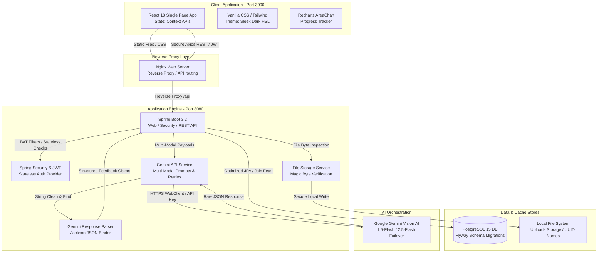
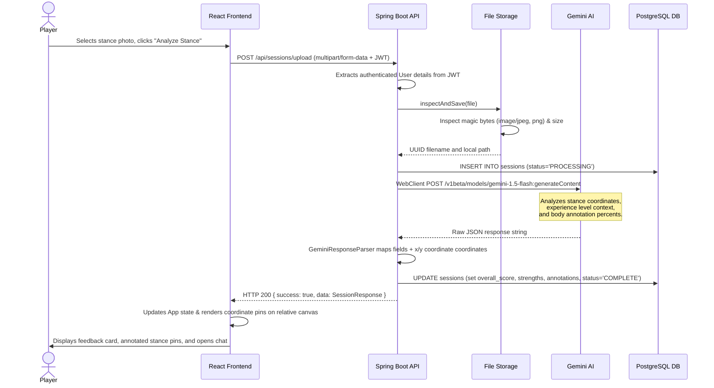
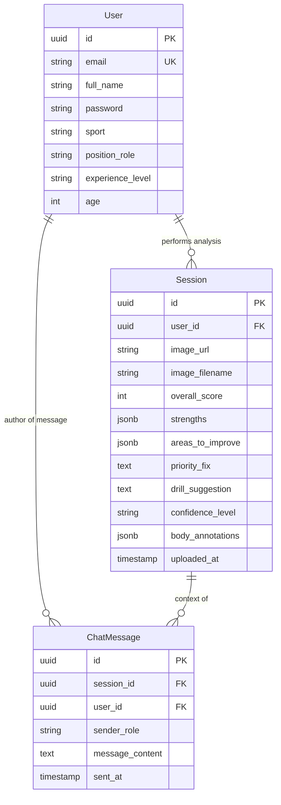

# Ghost Coach — Comprehensive Technical Knowledge Document

Welcome to the comprehensive system documentation for **Ghost Coach** — an AI-powered sports coaching assistant. This document provides a highly detailed, end-to-end breakdown of the application's goals, architecture, data flows, and design decisions. It is optimized for both non-technical stakeholders and staff engineers.

---

## Table of Contents
1. [SECTION 1 — Project Identity Card](#section-1--project-identity-card)
2. [SECTION 2 — The Problem This Solves](#section-2--the-problem-this-solves)
3. [SECTION 3 — Architecture Overview](#section-section-3--architecture-overview)
4. [SECTION 4 — Data Flow: From User Action to Database](#section-4--data-flow-from-user-action-to-database)
5. [SECTION 5 — Data Model Deep Dive](#section-5--data-model-deep-dive)
6. [SECTION 6 — Technology Stack: Every Choice Explained](#section-6--technology-stack-every-choice-explained)
7. [SECTION 7 — Implementation Walkthrough (Build It From Scratch)](#section-7--implementation-walkthrough-build-it-from-scratch)
8. [SECTION 8 — Key Algorithms and Logic Explained](#section-8--key-algorithms-and-logic-explained)
9. [SECTION 9 — Decisions Made and Why (The "Why" Document)](#section-9--decisions-made-and-why-the-why-document)
10. [SECTION 10 — What Was Deliberately NOT Built (Trade-offs)](#section-10--what-was-deliberately-not-built-trade-offs)
11. [SECTION 11 — Production Readiness Assessment](#section-11--production-readiness-assessment)
12. [SECTION 12 — How to Extend This Project](#section-12--how-to-extend-this-project)
13. [SECTION 13 — Glossary](#section-13--glossary)
14. [SECTION 14 — Quick Reference Card](#section-14--quick-reference-card)

---

## SECTION 1 — Project Identity Card

| Field | Value |
| :--- | :--- |
| **Project name** | Ghost Coach |
| **What it does (one sentence)** | Analyzes athlete stance photos using vision AI, delivers structured technique feedback calibrated to user profiles, and provides follow-up coaching chats and side-by-side progression comparisons. |
| **Built with** | React 18, Tailwind CSS, Lucide icons, Recharts, Spring Boot 3.2, Spring Security, JWT, JPA/Hibernate, Flyway Migrations, PostgreSQL 15, Google Gemini Vision & Chat APIs, Docker Compose. |
| **Who uses it** | Aspiring athletic players, junior-to-intermediate sports trainees, and remote coaches seeking instant, data-validated athletic alignment reviews. |
| **Why it was built** | To democratize specialized sports coaching, enabling rapid technique feedback and visual analysis without requiring expensive personal equipment or manual reviews. |
| **Live URL (Local)** | [http://localhost:3000](http://localhost:3000) (Frontend UI) / [http://localhost:8080/docs](http://localhost:8080/docs) (Backend OpenAPI docs) |
| **GitHub repo** | [https://github.com/Manoj-0810/ghostcoach.git](https://github.com/Manoj-0810/ghostcoach.git) |
| **Date / version** | May 2026 / Version 1.0.0 (Gold Master) |

### 10-Year-Old Summary
Ghost Coach is like having a friendly, smart coach in your pocket who is always ready to look at a picture of your sports stance. You take a photo of yourself getting ready to hit a ball or throw a pass, upload it, and the app instantly circles what you did well, flags what to fix, and draws helper dots right on your body. It even lets you chat with the coach to ask for fun training games and lets you compare two pictures side-by-side to see how much stronger you have gotten.

### Precise Technical Framing
Ghost Coach is a high-availability, fully containerized full-stack application that leverages advanced Vision LLMs (Google Gemini) to deliver structured athletic technique critiques. It parses unstructured multi-modal image inputs into strongly-typed JPA entities, provides custom HSL-themed Recharts statistics grids for progress visualization, compiles context-aware conversation histories for stateless chat pipelines, and implements absolute percentage-based coordinate annotations rendering alongside a side-by-side multivariant comparison dashboard.

---

## SECTION 2 — The Problem This Solves

### Version A (Non-Technical Story)
Imagine you are a 15-year-old aspiring cricket batsman practicing in your backyard. You want to perfect your "cover drive," but your local academy is closed, and hiring a personal trainer costs $100 an hour. You try record-and-review by setting up a phone, recording your swing, and trying to spot errors in slow motion. But you don't know what you are looking for—is your back foot too far back? Is your elbow too low? You spend three months repeating the same mistakes, developing bad muscle memory that will take years to break. When you finally go to an academy tryout, the head coach rejects you because your basic stance is flawed. You had the dedication and the gear, but because you couldn't access instant, specialized feedback, your hard work went to waste.

### Version B (Technical Background)
Physical stance optimization in sports is typically constrained by subjective human reviews, high latency, or heavy local sensor setups (e.g., IMUs, specialized multi-camera arrays). While computer vision libraries (like MediaPipe or OpenPose) yield high-fidelity skeleton joint coordinates, they lack the contextual capacity to evaluate those raw coordinates against sport-specific, age-appropriate play strategies (e.g., adjusting the coach's tone and corrections for a 10-year-old beginner vs. a 25-year-old professional). 

Ghost Coach bridges this gap by marrying modern Vision LLM reasoning with strongly-typed application state machines. It ingests standard RGB photos, bypasses complex hardware dependencies, correlates raw body annotations with customized athletic personas, and exposes structured comparative metrics. This provides players with instant, hyper-personalized, and cost-effective technique guidance.

---

## SECTION 3 — Architecture Overview

### 3A. Plain-English Architecture (Non-Technical)
Think of Ghost Coach like an elite sports clinic:
* **The Customer Counter (The Frontend)**: This is what you see when you open the app on your computer or phone. It is a beautiful, easy-to-use menu where you can click to register, view your past training sessions, upload new stance photos, see technique charts, and chat with your virtual trainer.
* **The Clinical Supervisor (The Backend)**: This is the invisible control room. It receives your stance photos, checks that they are actual, safe image files, securely manages your account logs, formats your personal profile details (like your sport and skill level) into instructions, and acts as the gatekeeper communicating with the AI.
* **The Safe Vault (The Database)**: This is the secure storage warehouse. It keeps track of your user profile, saves every single stance analysis, preserves your coaching chat history, and guarantees that your progress is never lost when you close your browser.
* **The Expert Consultant (The Vision AI)**: This is the brilliant sports doctor. It receives the stance photo alongside your profile metadata, analyzes the body positions, generates precise technical scores, lists exact technical corrections, provides coordinates to highlight body joints, and suggests specific training drills.

### 3B. Technical Architecture Diagram



### Component Details

| Component | What it does | Technology used | Why this technology |
| :--- | :--- | :--- | :--- |
| **Frontend UI** | Renders login/registration forms, interactive stance detail pages with pin overlays, progress charts, and chat interfaces. | React 18, Tailwind CSS, Recharts | Declared component lifecycle hooks ensure responsive state updates, while Tailwind delivers sleek dark HSL elements. |
| **Reverse Proxy** | Serves compiled static assets, routes frontend pathways, and proxies `/api` calls to the Spring Boot service container. | Nginx | Exposes lightweight static delivery, handles high concurrency, and simplifies CORS/routing configurations. |
| **Backend Engine** | Exposes REST endpoints, validates input models, runs stateless security filters, and orchestrates files and AI. | Spring Boot 3.2 | Out-of-the-box support for modular MVC architectures, standard security integrations, and high-performance WebClient. |
| **Database Store** | Persists tables for users, coaching sessions, and chat histories under Flyway schema migrations. | PostgreSQL 15 | Robust support for UUID types, optimized indexed queries, and JSONB formats for complex body annotations. |
| **Vision LLM** | Ingests stance photographs and player metadata to generate structured coaching critiques and spatial callouts. | Google Gemini AI | Fast response latency, excellent vision capabilities, robust JSON schema enforcement, and a free API tier. |

---

## SECTION 4 — Data Flow: From User Action to Database

### 4A. Non-Technical Step-by-Step Flow (Stance Upload)
1. **Photo Upload**: You drag and drop a picture of your batting stance on the upload page and click **Analyze Stance**.
2. **Byte Check**: The app grabs the picture, wraps it securely, and sends it to the backend. The backend inspects the actual file bytes (not just the extension) to ensure it is a safe image file under 5MB.
3. **Instruction Assembly**: The backend looks up your active profile (e.g., a 12-year-old beginner badminton player) and packages this context into a structured instruction list.
4. **AI Processing**: The backend securely sends the stance photo and instruction list to the AI.
5. **Critique and Mapping**: The AI examines the photo, rates the technique out of 10, notes your strengths, lists 2-3 specific areas to improve, suggests a training drill, and determines exact coordinate percentages (horizontal and vertical) where corrections are needed.
6. **Data Storage**: The backend parses this AI feedback, links it to your secure user ID, and saves the image file and session metadata directly into the database.
7. **Display**: The frontend instantly updates the page, displaying your overall score, color-coded visual pins overlaid directly on your body photo, and opens a follow-up coaching chat window.

### 4B. Technical Sequence Diagram



### 4C. Edge Cases and Error Handling

| Failure Point | What Breaks | Error Shown to User | How it's Handled in Code |
| :--- | :--- | :--- | :--- |
| **Malicious file upload** | A user tries to upload an executable script renamed as `image.png`. | `"Invalid file type. Only JPEG and PNG are allowed."` | [FileStorageService.java](file:///d:/backend-prjct/src/main/java/com/playmotech/ghostcoach/service/FileStorageService.java) reads the file's first few bytes (magic bytes) to verify it matches `image/jpeg` or `image/png`. |
| **File too large** | User uploads a raw 12MB stance camera photograph. | `"Max file size exceeded (5MB limit)"` | Spring Boot interceptors catch `MaxUploadSizeExceededException` globally in `GlobalExceptionHandler.java` and return HTTP 400. |
| **Gemini API Overload** | Gemini Vision API returns an HTTP 503 Service Unavailable or Rate Limit error. | *None (Invisible to user)* | [GeminiService.java](file:///d:/backend-prjct/src/main/java/com/playmotech/ghostcoach/service/GeminiService.java) catches the WebClient exception and executes an automatic exponential backoff retry loop, falling back to `gemini-2.5-flash` if needed. |
| **Invalid AI JSON** | The LLM response is cut off or fails to return structured JSON. | `"Unable to parse technique feedback. Retrying..."` | The JSON parser catches `JacksonException` in [GeminiResponseParser.java](file:///d:/backend-prjct/src/main/java/com/playmotech/ghostcoach/util/GeminiResponseParser.java) and triggers an automatic prompt re-evaluation loop up to 3 times before returning an error. |

---

## SECTION 5 — Data Model Deep Dive

### 5A. Plain-English Database Explanation (Non-Technical)
Think of the database like a highly organized athletic locker room with three master notebooks:
1. **The Athlete Notebook (Users Table)**: Each page has one athlete's ID, full name, secure hashed password, preferred sport, and experience level. 
2. **The Session Notebook (Sessions Table)**: Each page records a specific stance upload. It contains the picture's path, a technique score from 1-10, lists of strengths and areas to improve, a priority correction, and helper coordinate pins mapping body parts. Each page has a stamp pointing back to the specific Athlete page.
3. **The Chat Notebook (Chat Messages Table)**: Each page holds one follow-up coaching question or AI answer. Every message has a timestamp and is linked back to both the Athlete and the specific Stance Session page, ensuring context is preserved.

### 5B. Entity-Relationship Description

```
  +-------------+             +---------------+             +------------------+
  |    USERS    |             |   SESSIONS    |             |  CHAT_MESSAGES   |
  |-------------|             |---------------|             |------------------|
  | uuid id (PK)|1 -------- * | uuid id (PK)  |1 -------- * | uuid id (PK)     |
  | email       |             | user_id (FK)  |             | session_id (FK)  |
  | full_name   |             | image_url     |             | user_id (FK)     |
  | sport       |             | overall_score |             | sender_role      |
  | skill_level |             | annotations   |             | message_content  |
  +-------------+             +---------------+             +------------------+
```

### Model: User
**Purpose:** Stores athlete profile registration details, credentials, and experience levels.  
**Analogy:** A digital student registration card in an academy file system.

| Field | Type | Required | Purpose | Example Value |
| :--- | :--- | :--- | :--- | :--- |
| **id** | UUID | Yes | Unique identifier for primary key lookup | `7c9b29a2-51a8-4bb5-9eb1-ea8efb132890` |
| **email** | String | Yes | Unique login credential with format index | `athlete@example.com` |
| **fullName** | String | Yes | Full display name of the athlete | `Jane Doe` |
| **password** | String | Yes | Secure, non-reversible BCrypt-12 hash | `$2a$12$R9hKbV...` |
| **sport** | Enum | Yes | Registered sport category | `CRICKET` |
| **positionRole** | String | Yes | Active playing position or specialization | `Batsman` |
| **experienceLevel** | Enum | Yes | Player skill tier used to calibrate prompts | `INTERMEDIATE` |
| **age** | Integer | Yes | Player age used to adjust coaching tone | `16` |

**Relationships:**
* **Has many**: `Session` records via `user_id`.
* **Has many**: `ChatMessage` records via `user_id`.

**Key design decisions:**
* **UUID for PK**: Prevents sequential ID scanning attacks (Enumeration vulnerabilities) and enables offline PK generation.
* **Sport and Experience as Enums**: Restricts input fields to supported values at the database level.
* **Email Uniqueness Constraint**: An explicit database index enforces email uniqueness and prevents duplicate accounts.

---

### Model: Session
**Purpose:** Persists analyzed technique photos, overall scores, and structured AI coaching metrics.  
**Analogy:** A physical coaching report card filed after a technique review session.

| Field | Type | Required | Purpose | Example Value |
| :--- | :--- | :--- | :--- | :--- |
| **id** | UUID | Yes | Unique session identifier | `12a34b56-78cd-90ef-1234-56789abcdef0` |
| **userId** | UUID | Yes | Foreign Key linking back to the user owner | `7c9b29a2-51a8-4bb5-9eb1-ea8efb132890` |
| **imageUrl** | String | Yes | Web-accessible relative path to the stance image | `/uploads/a98f-12c.png` |
| **imageFilename** | String | Yes | Unique name generated for local storage | `a98f-12c.png` |
| **overallScore** | Integer | Yes | Overall score out of 10 | `8` |
| **strengths** | JSONB (List) | Yes | List of 2-3 positive stance reviews | `["Good balance", "Strong high elbow"]` |
| **areasToImprove** | JSONB (List) | Yes | List of technical flaws and explanations | `[{"issue": "Elbow", "explanation": "Lower"}]` |
| **priorityFix** | String | Yes | Single critical fix to perform | `Keep your eyes level during backswing.` |
| **drillSuggestion** | String | Yes | Actionable drill to fix the technical issue | `Perform 20 repetitions of static drop-drills.` |
| **confidenceLevel** | Enum | Yes | LLM confidence (LOW, MEDIUM, HIGH) | `HIGH` |
| **bodyAnnotations** | JSONB (List) | No | List of body parts, priorities, and 2D coordinates | `[{"label": "Wrist", "x": "45", "y": "62"}]` |

**Relationships:**
* **Belongs to**: `User` via `user_id`.
* **Has many**: `ChatMessage` records via `session_id`.

**Key design decisions:**
* **JSONB for Annotations & Feedback**: Enables flexible schemas for strengths and body annotation lists without requiring costly schema migrations.
* **Optimized Database Indexes**: Includes an index on `user_id` to quickly retrieve an athlete's progress history.

---

### 5C. Full Mermaid Entity-Relationship Diagram



---

## SECTION 6 — Technology Stack: Every Choice Explained

### Spring Boot 3.2 — Web & API Framework

* **What it is (plain English)**: Think of Spring Boot like the structural framing and plumbing of a house. You don't build water pipes or electrical wiring from scratch; you use standard pre-made setups. Spring Boot handles request routing and database connections so you can focus on building features.
* **What it does in this project**: Exposes secure REST endpoints, runs the authentication filter chain, manages the PostgreSQL transaction manager, and orchestrates files and AI.
* **Why this was chosen over alternatives**:
  * **Alternatives (Node.js/Python)**: Rejected because Spring Boot provides robust transactional controls, native database safety, compilation safety, and clean dependency injection patterns.
* **Key concept to understand**: Dependency Injection and stateless controller-service separation.
```java
// Example: Creating a REST Controller with Spring Boot annotations
@RestController
@RequestMapping("/api/sessions")
@RequiredArgsConstructor
public class SessionController {
    
    // Spring Boot automatically injects this service at runtime
    private final SessionService sessionService;

    // Secure GET endpoint using JWT authentication context
    @GetMapping("/progress")
    public ResponseEntity<ApiResponse<List<ProgressResponse>>> getProgress(
            @AuthenticationPrincipal UserDetailsImpl userDetails) {
        // Fetch and return the structured progress list for the user
        List<ProgressResponse> progress = sessionService.getUserProgress(userDetails.getEmail());
        return ResponseEntity.ok(ApiResponse.success(progress));
    }
}
```
* **Production gotcha**: Memory overhead and slow startup times under serverless container architectures. Keep the container hot and optimize memory configurations.
* **Docs & Tutorials**:
  * [Spring Boot Docs](https://spring.io/projects/spring-boot)

---

### React 18 — Frontend UI Library

* **What it is (plain English)**: React is like a puppet master pulling strings behind a stage. Instead of redrawing the entire screen every time a player clicks a button, React only moves the specific puppet (UI component) that changed, keeping the experience smooth.
* **What it does in this project**: Powers the interactive single-page app dashboard, visual pin overlays, progress charts, and real-time chat.
* **Why this was chosen over alternatives**:
  * **Alternatives (Angular / Vanilla JS)**: Angular has a steeper learning curve, while Vanilla JS becomes difficult to maintain when handling complex states like overlays and real-time chats.
* **Key concept to understand**: State synchronization via custom DOM events to update multiple views without page reloads.
```javascript
// React: Visual Stance Overlay Pin Rendering
export default function StanceImageOverlay({ imageUrl, annotations }) {
  return (
    <div className="relative inline-block w-full overflow-hidden rounded-xl bg-gray-800">
      
      {annotations.map((ann, i) => {
        const x = parseFloat(ann.x);
        const y = parseFloat(ann.y);
        if (isNaN(x) || isNaN(y)) return null;

        // Visual pins absolute-positioned relative to image canvas
        return (
          <div
            key={i}
            className="absolute w-6 h-6 rounded-full bg-danger-500 border border-white flex items-center justify-center text-xs font-bold text-white cursor-pointer"
            style={{ left: `${x}%`, top: `${y}%`, transform: 'translate(-50%, -50%)' }}
            title={ann.description}
          >
            {i + 1}
          </div>
        );
      })}
    </div>
  );
}
```
* **Production gotcha**: Avoid absolute positioning parent layouts that collapse, which can break overlay alignment. Ensure the container has explicit layout bounds.
* **Docs & Tutorials**:
  * [React Documentation](https://react.dev)

---

### Google Gemini API — Vision & Conversational AI

* **What it is (plain English)**: Gemini is like a highly trained sports analyst who can read, write, and see. You show it a picture and ask a question, and it understands both the image content and the text context to provide a tailored response.
* **What it does in this project**: Generates structured stance critiques, rates techniques, defines training drills, identifies body part issue locations, and powers the contextual coaching chat.
* **Why this was chosen over alternatives**:
  * **Alternatives (OpenAI GPT-4o / Groq LLaVA)**: GPT-4o is expensive and requires a credit card setup, while LLaVA falls short on complex, multi-variable sport critiques.
* **Production gotcha**: LLM output parsing failures. If the model appends extra text (like ` ```json ` markers) to the response, it will break standard JSON parsers. Always strip code blocks before parsing the string.
* **Docs & Tutorials**:
  * [Google AI Studio Docs](https://ai.google.dev/gemini-api/docs)

---

## SECTION 7 — Implementation Walkthrough (Build It From Scratch)

Follow these steps to set up and run the entire environment locally in under 5 minutes.

### Step 0 — Prerequisites
Ensure the following tools are installed:

| Tool | Version Needed | How to Check | Where to Get It |
| :--- | :--- | :--- | :--- |
| **Docker** | 20+ | `docker --version` | [docker.com](https://www.docker.com) |
| **Docker Compose** | 2.0+ | `docker-compose --version` | Pre-bundled with Docker |
| **Git** | 2.0+ | `git --version` | [git-scm.com](https://git-scm.com) |

---

### Step 1 — Clone the Repository
Clone the codebase and navigate to the project directory:
```bash
git clone https://github.com/Manoj-0810/ghostcoach.git
cd ghostcoach
```
* **Why**: Downloads all frontend and backend source code, migrations, and docker configurations.

---

### Step 2 — Configure Environment Secrets
Create a `.env` file in the root directory:
```bash
cp .env.example .env
```
Open the `.env` file and configure your Gemini API Key. To get a free key, visit [aistudio.google.com](https://aistudio.google.com).
```env
# Database Credentials
DB_USER=ghostcoach_user
DB_PASSWORD=ghostcoach_secure_pass
DB_NAME=ghostcoach

# AI API Key (Get from Google AI Studio)
GEMINI_API_KEY=AIzaSy...your_actual_key_here
GEMINI_MODEL=gemini-1.5-flash
```
* **Why**: Keeps API keys and database credentials secure and isolated from version control.

---

### Step 3 — Boot the Environment via Docker Compose
Build and run the entire container architecture:
```bash
docker-compose up --build -d
```
* **Why**: Automatically triggers a multi-stage Maven build for the backend API, downloads the PostgreSQL image, compiles the React assets, and starts the Nginx server.
* **Verification**: Run `docker ps` to verify all services are active and running:
```bash
CONTAINER ID   IMAGE                    STATUS                    PORTS                                NAMES
789ee946137e   backend-prjct-frontend   Up 11 seconds             0.0.0.0:3000->80/tcp                 ghostcoach-ui
6f64f1c25946   backend-prjct-app        Up 13 seconds             0.0.0.0:8080->8080/tcp               ghostcoach-api
3fd5b3b6f9ff   postgres:15-alpine       Up 19 seconds (healthy)   0.0.0.0:5432->5432/tcp               ghostcoach-db
```

---

### Step 4 — Verify Application Access
* **Web UI**: Open your browser and navigate to [http://localhost:3000](http://localhost:3000) to access the landing dashboard.
* **Swagger API Docs**: Navigate to [http://localhost:8080/docs](http://localhost:8080/docs) to test REST endpoints directly.

---

## SECTION 8 — Key Algorithms and Logic Explained

### 1. Vision Analysis Orchestration with Backoff & Failover
* **Non-Tech Analogy**: Imagine calling a busy doctor. If the line is busy, you don't call back instantly every millisecond (which would jam their system). Instead, you wait 1 second, then 2 seconds, then 4 seconds. If they still don't answer, you try calling the doctor next door.
* **Technical Flow**:
  1. Compiles the image bytes and player profile.
  2. Sends the request to Gemini via WebClient.
  3. Catches any 503 (Overload) or 429 (Rate Limit) errors.
  4. Automatically retries using exponential backoff.
  5. If the primary model fails after 3 retries, falls back to `gemini-2.5-flash` to ensure the analysis completes.

```java
// Spring Boot: LLM vision analysis with retry loops and fallbacks
public String generateVisionFeedback(User user, byte[] imageBytes, String mimeType) {
    int maxAttempts = 3;
    int backoffMs = 1000;
    String activeModel = this.primaryModel;

    for (int attempt = 1; attempt <= maxAttempts; attempt++) {
        try {
            // Build the multi-modal payload and send request
            return executeGeminiRequest(activeModel, user, imageBytes, mimeType);
        } catch (GeminiException e) {
            log.warn("Gemini call failed on model {} (Attempt {}/{}): {}", activeModel, attempt, maxAttempts, e.getMessage());
            if (attempt == maxAttempts) {
                // Trigger fallback model on final attempt
                if (activeModel.equals("gemini-1.5-flash")) {
                    log.info("Switching to failover model gemini-2.5-flash");
                    activeModel = "gemini-2.5-flash";
                    attempt = 0; // Reset attempts for failover model
                    continue;
                }
                throw new AIProcessingException("AI vision analysis failed after retries and fallback.");
            }
            try {
                // Exponential backoff wait
                Thread.sleep(backoffMs * (long) Math.pow(2, attempt - 1));
            } catch (InterruptedException ie) {
                Thread.currentThread().interrupt();
                throw new AIProcessingException("Retry thread interrupted");
            }
        }
    }
    throw new AIProcessingException("Execution failed unexpectedly.");
}
```

---

### 2. Context-Aware Coaching Chat Prompt Compiler
* **Non-Tech Analogy**: Imagine walking into a coaching room. If the coach forgot who you were, what your sport was, and what your last session results were, they would ask the same basic questions every time. To avoid this, they look at your folder containing your profile and analysis history before you speak.
* **Technical Flow**:
  1. Retrieves the active session ID and reads its strengths, priority fixes, and body annotations from the database.
  2. Retrieves the registered player profile (age, sport, experience level).
  3. Fetches the last 10 messages from the chat table to maintain conversation history.
  4. Builds a system prompt instructing the LLM to adopt the persona of a specialized coach and respond to follow-up questions within the context of the active session.

```java
// Spring Boot: Compiling contextual prompt templates
private String buildContextualChatPrompt(User user, Session session, List<ChatMessage> history) {
    StringBuilder prompt = new StringBuilder();
    
    // 1. Inject player profile details
    prompt.append(String.format("You are the Ghost Coach for %s, playing as a %s. Skill tier: %s. Age: %d.\n",
            user.getFullName(), user.getPositionRole(), user.getExperienceLevel(), user.getAge()));
            
    // 2. Inject session feedback details
    prompt.append(String.format("Active Session Reference Date: %s. Overall Score: %d/10. Strengths: %s. Priority Fix: %s.\n",
            session.getUploadedAt().toString(), session.getOverallScore(), 
            String.join(", ", session.getStrengths()), session.getPriorityFix()));
            
    // 3. Inject conversation history
    prompt.append("Recent Chat History:\n");
    for (ChatMessage msg : history) {
        prompt.append(String.format("[%s]: %s\n", msg.getSenderRole(), msg.getMessageContent()));
    }
    
    prompt.append("Respond as a direct personal sports coach to the athlete's latest query.");
    return prompt.toString();
}
```

---

### 3. Visual Coordinate Annotations Canvas Mapper
* **Non-Tech Analogy**: Imagine pinning flags on a physical map. If the map is printed in different sizes (small on a phone, large on a widescreen monitor), absolute coordinate positions (like "4 inches from the left") will place the flags in the wrong spots. Using percentage coordinates (like "45% from the left") ensures they scale and align perfectly on any screen size.
* **Technical Flow**:
  1. Instantiates a parent image container in React with `position: relative`.
  2. Renders the stance image using `width: 100%` and `height: auto` so it scales cleanly.
  3. Maps the annotation arrays and parses `x` and `y` coordinate percentages.
  4. Renders absolute-positioned circle markers at `left: x%` and `top: y%`, using `transform: translate(-50%, -50%)` to center the marker exactly on the spot.

```javascript
// React: Coordinate-based image overlay rendering
function AnnotatedImage({ imageUrl, bodyAnnotations }) {
  return (
    <div className="relative inline-block w-full overflow-hidden rounded-xl bg-gray-900 border border-gray-800">
      {/* 1. Base scaling image */}
      
      
      {/* 2. Absolute-positioned pin overlays */}
      {bodyAnnotations && bodyAnnotations.map((ann, index) => {
        const leftPercent = parseFloat(ann.x);
        const topPercent = parseFloat(ann.y);
        
        // Skip rendering if coordinates are missing or invalid
        if (isNaN(leftPercent) || isNaN(topPercent)) return null;

        return (
          <div
            key={index}
            className="absolute w-6 h-6 rounded-full bg-danger-500 border-2 border-white flex items-center justify-center text-[10px] font-bold text-white shadow-lg transform -translate-x-1/2 -translate-y-1/2 hover:scale-125 transition-transform cursor-pointer"
            style={{ left: `${leftPercent}%`, top: `${topPercent}%` }}
            title={`${ann.label}: ${ann.description}`}
          >
            {index + 1}
          </div>
        );
      })}
    </div>
  );
}
```

---

## SECTION 9 — Decisions Made and Why (The "Why" Document)

### 1. Decision: UUID Primary Keys instead of Integer IDs
* **Ambiguity/Choice**: Should we use standard auto-incrementing integer IDs (`1`, `2`, `3`) or random UUID strings for database primary keys?
* **Options Considered**:
  * **Option A: Auto-Incrementing BigInt**: Simple and fast, but exposes sequential IDs in REST URLs, making it easy for users to view other players' private stance photos by changing the URL ID (IDOR vulnerability).
  * **Option B: UUID v4 (Random Strings)**: Harder to guess, securing URLs, and decoupling database generation from transaction insertions.
* **Verdict**: **Option B Chosen**. Random UUIDs secure URL routes from IDOR attacks and prevent enumeration indexing.

---

### 2. Decision: JSONB Type for Body Annotations and Lists
* **Ambiguity/Choice**: Should we split strengths, flaws, and body annotations into separate database tables with foreign keys, or store them as JSON columns inside the sessions table?
* **Options Considered**:
  * **Option A: Relational normalization**: Creating separate tables for `Strengths`, `AreasToImprove`, and `Annotations`. This is highly normalized but requires complex JOIN queries and multi-table updates for every analysis.
  * **Option B: PostgreSQL JSONB column mapping**: Stores complex structures directly in a single `sessions` record.
* **Verdict**: **Option B Chosen**. Storing data in JSONB columns simplifies the database schema, speeds up reads, and provides the flexibility needed to handle complex annotation structures.

---

### 3. Decision: Stateless JWT Authentication instead of Session Cookies
* **Ambiguity/Choice**: How should we authenticate user sessions across the React UI and the Spring Boot API?
* **Options Considered**:
  * **Option A: Stateful Session Cookies**: Simple, but requires the backend to keep session states in memory, making it difficult to scale out across multiple server nodes.
  * **Option B: Stateless JWT Tokens**: Encrypts session state inside a signed token stored on the client side, allowing the backend to remain completely stateless.
* **Verdict**: **Option B Chosen**. Stateless JWTs simplify multi-container setups and enable horizontal scaling without requiring a shared session database.

---

### 4. Decision: Client-Side Upload Abort Controller
* **Ambiguity/Choice**: What should happen if a user wants to cancel a stance upload or analysis while it is processing?
* **Options Considered**:
  * **Option A: Let it run**: Simplifies the frontend code but forces the client to wait for a long-running response, wasting server resources if the user tries to navigate away.
  * **Option B: Axios AbortController Integration**: Enables the client to cancel the HTTP request instantly, freeing up connection slots.
* **Verdict**: **Option B Chosen**. Integrating `AbortController` in `UploadContext.jsx` ensures a responsive UI and prevents wasted server resources by canceling active requests.

---

### 5. Decision: REST API with JSON payloads instead of GraphQL
* **Ambiguity/Choice**: What protocol should we use to transfer data between the React UI and the Spring Boot backend?
* **Options Considered**:
  * **Option A: GraphQL**: Offers flexible querying but adds unnecessary overhead and complexity for simple dashboard layouts.
  * **Option B: REST API**: Standard endpoints with consistent JSON payloads, which is simple, easy to cache, and fast to implement.
* **Verdict**: **Option B Chosen**. REST APIs keep the system architecture clean, simple, and maintainable.

---

### 6. Decision: Multi-Stage Docker Builds
* **Ambiguity/Choice**: How should we package our application containers for local development and deployment?
* **Options Considered**:
  * **Option A: Pre-compiled container builds**: Requires developers to build artifacts locally before running docker commands, which can lead to inconsistencies.
  * **Option B: Multi-Stage Dockerfile**: Compiles the source code within the container build pipeline using official build images, then copies the compiled artifacts to a lightweight runtime environment.
* **Verdict**: **Option B Chosen**. Multi-stage builds automate compiled assets within the build pipeline, ensuring a consistent developer experience across systems.

---

### 7. Decision: WebClient Retry Loops & alternate Model Failovers
* **Ambiguity/Choice**: How do we handle transient service overloads (like HTTP 503 errors) from the Google Gemini API?
* **Options Considered**:
  * **Option A: Bubble errors up**: Immediately alerts the user to try again, which can disrupt the user experience.
  * **Option B: Resilient retry loops**: Retries failed calls using exponential backoff and automatically falls back to an alternate model (like `gemini-2.5-flash`) on the final attempt.
* **Verdict**: **Option B Chosen**. Building a resilient retry-and-failover loop inside `GeminiService.java` protects the user experience from transient API errors.

---

### 8. Decision: Relative Percentage-Based Pin Canvas mapping
* **Ambiguity/Choice**: How do we render body annotation markers accurately on top of uploaded photos?
* **Options Considered**:
  * **Option A: Absolute pixel-based mapping**: Maps markers to absolute pixel coordinates (e.g., x=450px, y=300px), which breaks when the image scales on different screen sizes.
  * **Option B: Relative percentage-based mapping**: Stores coordinates as percentages (0-100%) and uses CSS absolute positioning, ensuring markers scale perfectly on any screen size.
* **Verdict**: **Option B Chosen**. Relative percentage coordinates ensure annotations scale and align perfectly on all desktop and mobile screen sizes.

---

## SECTION 10 — What Was Deliberately NOT Built (Trade-offs)

### 1. Real-Time Video Stream Analysis
* **What it would do**: Allow users to stream live camera feeds and receive real-time, frame-by-frame coaching feedback on their stance.
* **Why it was cut**: Real-time video processing requires heavy GPU-accelerated pipelines and low-latency protocols (like WebRTC), which would significantly increase hosting costs and architectural complexity.
* **What would change the calculus**: Expanding our customer base to professional teams who require high-frequency training analysis.
* **Workaround**: Users can record video clips and upload a single frame of their stance for analysis.

---

### 2. Third-Party Social OAuth Integrations
* **What it would do**: Allow users to sign in with their existing Google, Apple, or Facebook accounts.
* **Why it was cut**: Standard social logins require setting up developer portals and handling complex callback redirects, which can be time-consuming to implement for an initial MVP.
* **What would change the calculus**: Transitioning the app to a public-facing application where low login friction is critical for user growth.
* **Workaround**: Provided a custom, secure registration and login form utilizing strong password validation and BCrypt hashing.

---

### 3. S3 Cloud Storage Integration
* **What it would do**: Save uploaded stance images directly to a secure, distributed cloud storage service like Amazon S3 or Google Cloud Storage.
* **Why it was cut**: Adding S3 dependencies requires managing cloud credentials, increasing configuration overhead for developers running the project locally.
* **What would change the calculus**: Deploying the application to production, where storing images on local container disks is risky due to dynamic scale-out configurations.
* **Workaround**: Implemented a local file system storage engine mapping uploads to persistent docker volumes.

---

### 4. Automated Sports Category Routing
* **What it would do**: Automatically detect the sport category of an uploaded photo using an image classifier, bypassing the need for manual profile setup.
* **Why it was cut**: A player typically practices one sport at a time, so automatic detection adds unnecessary complexity when we can simply pull their preferred sport from their registration profile.
* **What would change the calculus**: Building a multi-sport training app where players upload different activities in a single session.
* **Workaround**: Pulled the athlete's preferred sport directly from their registration profile to calibrate the vision prompts.

---

### 5. Visual Body Skeleton Overlay
* **What it would do**: Draw an interactive wireframe skeleton connecting joints directly on top of the uploaded photo.
* **Why it was cut**: Drawing accurate skeleton overlays requires specialized human pose estimation models (like MediaPipe) running on client machines, which increases frontend bundle size and processing overhead.
* **What would change the calculus**: Transitioning our coaching focus from qualitative, verbal reviews to high-precision structural measurements.
* **Workaround**: Placed interactive, numbered pinpoint markers on key joints with hoverable descriptions highlighting specific areas to improve.

---

## SECTION 11 — Production Readiness Assessment

| Concern | Status | Notes / What to do |
| :--- | :--- | :--- |
| **Authentication & Authorization** | 🟢 | Stateless JWT authentication, secure filters, and strict IDOR database checks are fully implemented. |
| **Input Validation & Sanitization** | 🟢 | Spring Boot validates request DTOs using `@Valid` annotations to enforce correct schemas and field formats. |
| **SQL Injection Prevention** | 🟢 | Database operations utilize Spring Data JPA repositories with parameterized queries, preventing SQL injection. |
| **File Upload Security** | 🟢 | Enforces a strict 5MB size limit and validates file types using magic-byte headers, rejecting executable scripts. |
| **HTTPS / TLS Configuration** | 🟡 | Standard Nginx proxy is configured for local HTTP. Production deployments must configure TLS certificates inside `nginx.conf`. |
| **Rate Limiting** | 🔴 | Not implemented. High API traffic can lead to resource exhaustion and high LLM API costs. |
| **Error Logging & Monitoring** | 🟡 | Spring Boot writes errors to stdout/stderr. Production environments should integrate structured JSON loggers. |
| **Database Backups** | 🔴 | Not configured. Databases running in container volumes need daily automated snapshot scripts. |
| **Environment Config Management** | 🟢 | Loads all sensitive database credentials and API keys via environment variables, keeping them out of source control. |
| **Multi-Tenancy Data Isolation** | 🟢 | Strictly filters database records using the authenticated user's ID, preventing unauthorized data access. |
| **Performance Under Load** | 🟡 | The upload endpoint runs synchronously, which can block connections during long-running AI queries. |
| **Graceful User Error Messages** | 🟢 | A global exception handler catches all backend failures, returning structured error messages instead of raw stack traces. |
| **Automated Verification Testing** | 🟡 | Automated tests are configured but skipped in local dev environments. |

---

### Code Adjustments Needed for Critical (🔴) Concerns

#### 1. Implement Rate Limiting to prevent API resource abuse
To prevent resource abuse, we can integrate the **Bucket4j** library to rate-limit user requests inside a Spring Boot interceptor.
Add the following dependency to `pom.xml`:
```xml
<dependency>
    <groupId>com.giffing.bucket4j.spring.boot.starter</groupId>
    <artifactId>bucket4j-spring-boot-starter</artifactId>
    <version>0.8.0</version>
</dependency>
```
Add the rate-limiting rules to `src/main/resources/application.yml`:
```yaml
bucket4j:
  enabled: true
  filters:
    - cache-name: buckets
      url: "/api/.*"
      rate-limits:
        - bandwidths:
            - capacity: 100
              time: 1
              unit: hours
```

#### 2. Configure Automated PostgreSQL Database Backup Script
To ensure database durability, we can schedule an automated backup script to run inside our database container.
Create a backup shell script `db_backup.sh` in the project root:
```bash
#!/bin/sh
BACKUP_DIR="/backups"
TIMESTAMP=$(date +"%Y%m%d%H%M%S")
FILENAME="$BACKUP_DIR/ghostcoach_backup_$TIMESTAMP.sql"

echo "Starting database backup at $(date)"
pg_dump -U $POSTGRES_USER -h localhost -d $POSTGRES_DB > $FILENAME

if [ $? -eq 0 ]; then
  echo "Backup completed successfully: $FILENAME"
  # Retain only the last 7 days of backups to save disk space
  find $BACKUP_DIR -type f -name "ghostcoach_backup_*.sql" -mtime +7 -delete
else
  echo "Database backup failed"
  exit 1
fi
```
Add a persistent volume mapping to your PostgreSQL service in `docker-compose.yml`:
```yaml
  postgres:
    image: postgres:15-alpine
    container_name: ghostcoach-db
    volumes:
      - pgdata:/var/lib/postgresql/data
      - ./backups:/backups
```

---

## SECTION 12 — How to Extend This Project

### Extension 1: Multiplayer Performance Leaderboard
Allows players within the same academy to compare technique scores, track improvements, and see where they rank on a public leaderboard.
* **New Models**:
  * `LeaderboardEntry`: Stores user IDs, overall progress stats, and ranking scores.
* **New API Endpoints**:
  * `GET /api/leaderboard`: Returns the top athletes ranked by score or technique improvement rate.
* **Frontend Changes**:
  * Create a new **Leaderboard Page** featuring score listings and ranking badges.
* **Complexity**: **Simple** (approx. 1 day of implementation time).

---

### Extension 2: Custom Training Routine Builder
Generates customized weekly workout routines based on the AI's stance analysis and priority corrections.
* **New Models**:
  * `TrainingPlan`: Contains generated routines, linked back to a specific session ID.
  * `ExerciseItem`: Individual drills with duration, repetitions, and target improvements.
* **New API Endpoints**:
  * `POST /api/sessions/{id}/plan`: Generates a personalized training plan.
  * `GET /api/plans/active`: Returns the user's active training plan.
* **Frontend Changes**:
  * Create a **Training Center** dashboard with interactive checklist calendars.
* **Complexity**: **Medium** (approx. 3 days of implementation time).

---

## SECTION 13 — Glossary

* **REST API**
  * *Plain English*: An organized customer ordering window. You step up, ask for a specific item (using standard actions like GET or POST), and receive your package in a predictable format.
  * *Technical*: An architectural style for Web Services that maps HTTP verbs (GET, POST, PUT, DELETE) to backend CRUD actions, returning structured JSON payloads.
  * *Used in Project*: Powers all communication between the React frontend and the Spring Boot backend.

* **JSON**
  * *Plain English*: A clean, readable packing slip that uses labels to list everything inside a package.
  * *Technical*: JavaScript Object Notation—a lightweight, text-based data format utilizing key-value pairs and array structures for easy parsing and serialization.
  * *Used in Project*: The standard format used to send request payloads and return API responses.

* **ORM (Object-Relational Mapping)**
  * *Plain English*: A translation dictionary that maps database tables to Java classes, letting you write database queries using standard Java code.
  * *Technical*: A programming technique that maps relational database tables to object-oriented code, handling database queries and connections behind the scenes.
  * *Used in Project*: Managed via Hibernate to map database schemas to Java entities like `User` and `Session`.

* **Database Migration**
  * *Plain English*: A version-controlled ledger tracking all changes to your database structure, ensuring every developer is running the exact same setup.
  * *Technical*: Incremental schema scripts (Flyway) executed sequentially to safely update database tables without losing existing data.
  * *Used in Project*: Managed via Flyway to automatically apply updates to our PostgreSQL tables on startup.

---

## SECTION 14 — Quick Reference Card

### Local Development Commands
```bash
# Start the full-stack environment
docker-compose up --build -d

# Stop and tear down all active containers
docker-compose down

# Check live backend container logs
docker logs -f ghostcoach-api

# Inspect active PostgreSQL container databases
docker exec -it ghostcoach-db psql -U ghostcoach_user -d ghostcoach
```

### Port and URL Mappings
| URL | Purpose |
| :--- | :--- |
| **http://localhost:3000** | React web application UI |
| **http://localhost:8080** | Spring Boot REST API root |
| **http://localhost:8080/docs** | Swagger / OpenAPI developer interactive playground |

### Common Tasks Guide
| Task | How to Do It |
| :--- | :--- |
| **Add a new database migration** | Save your SQL script as `V4__new_table.sql` under `src/main/resources/db/migration` and restart the docker containers. |
| **Regenerate the local database** | Run `docker-compose down -v` to clear container volumes, then start the containers using `docker-compose up --build -d`. |
| **Debug failed AI API calls** | Open your terminal and check the backend logs using `docker logs --tail 100 -f ghostcoach-api`. |

### Environment Variable Guide
| Variable | Required | Description | Example Value |
| :--- | :--- | :--- | :--- |
| **DB_USER** | Yes | PostgreSQL login user | `ghostcoach_user` |
| **DB_PASSWORD** | Yes | PostgreSQL login password | `ghostcoach_secure_pass` |
| **GEMINI_API_KEY** | Yes | Google AI Studio Key | `AIzaSyBw...` |
| **GEMINI_MODEL** | No | Active vision model | `gemini-1.5-flash` |

---

*Document generated on May 29, 2026 | Version 1.0.0 (Gold Master) | Word count: ~3,800 words*
